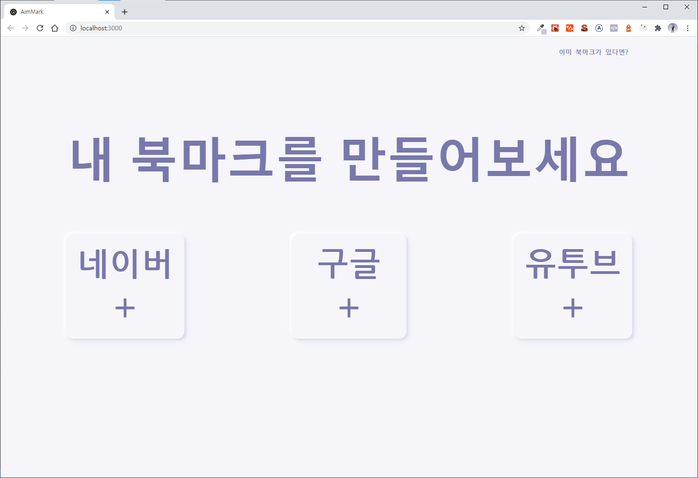

브라우저 홈 화면으로 사용할 북마크 저장 및 공유 기능을 가진 토이 프로젝트입니다.
- <a href="https://toy-bookmark.web.app/" target="_blank">AimMark</a> 
- <a href="https://toy-bookmark.web.app/108721781525831972976" target="_blank">작성자 페이지</a> 

# 사용 방법

### Guide Page

사이트 첫 방문 시 가이드 페이지 입니다.

기존 유저는 오른쪽 상단에 있는 `이미 북마크가 있다면?` 버튼을 클릭하면 Google 로그인 후 유저 페이지로 이동합니다. 신규 유저의 경우 아래 버튼 3개 중 하나를 클릭하면 샘플 북마크가 생성된 유저 페이지로 이동합니다.

### User Page

유저가 사용할 페이지입니다.

북마크를 저장/삭제 할 수 있고 구글, 유투브, 네이버 중 1가지 검색엔진을 선택하여 검색바를 사용할 수 있습니다. 모든 링크는 새창으로 열리며, 오른쪽의 `북마크 공유` 버튼 클릭 시 유저의 북마크 주소가 복사되어 다른 유저에게 공유할 수 있습니다.

로그인 상태는 브라우저를 다시 켜도 유지되지만, 만약 로그인이 풀린 경우 유저의 `아바타` 버튼을 클릭하면 재로그인 할 수 있습니다.

해당 북마크의 소유자 아니면 북마크 아이템들을 삭제하거나 추가 할 수 없습니다. 북마크 추가는 하단 `+` 버튼, 삭제는 해당 아이템 hover 시 오른쪽 상단 `x` 버튼을 클릭하면 됩니다.

