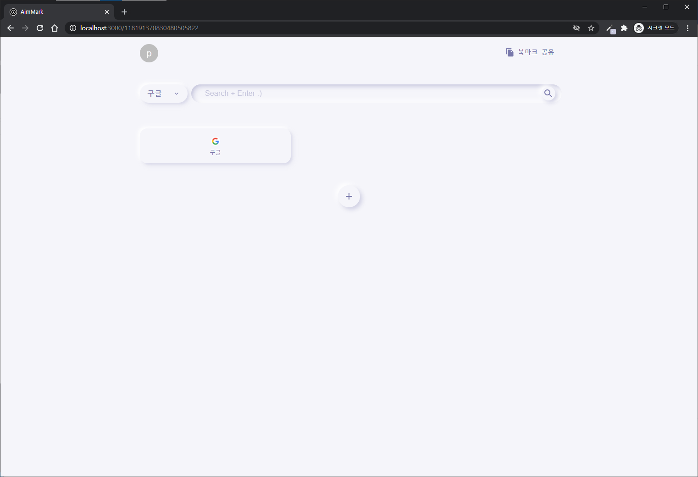

# <a href="https://toy-bookmark.web.app/" target="_blank">AimMark</a>

브라우저 홈 화면으로 사용할 북마크 저장 및 공유 기능을 가진 토이 프로젝트입니다.

# 사용 방법

`main page`는 검색 바와 가장 최근에 등록된 북마크 20개가 노출됩니다. 검색 바의 검색엔진은 Naver, Google, Youtube 중 한 가지를 선택하여 검색하면 됩니다.

회원 연동은 Google 로그인을 통해 이루어지며, 로그인 시 `client page`로 이동하게 됩니다. 로그인한 경우, `client page`의 정보를 수정할 수 있으며 검색 바에서 선택한 검색엔진도 저장됩니다.

북마크 공유 버튼 클릭 시 현재 북마크 주소가 복사됩니다.

북마크 등록 버튼 클릭 시 등록 팝업이 노출되며, 등록할 북마크의 이름, URL, 공개 여부를 선택하여 추가할 수 있습니다. 등록된 북마크는 이름순으로 정렬됩니다.

비공개로 선택된 북마크의 경우 아이콘 우측 상단에 자물쇠 표시가 붙으며, 해당 페이지 소유자 외에는 북마크가 노출되지 않습니다. (`main page` 노출도 되지 않습니다.)

등록된 북마크 우측 상단의 **x** 버튼 클릭 시 삭제 확인 여부 브라우저 팝업이 노출되며 확인 클릭 시 해당 북마크는 삭제됩니다.
